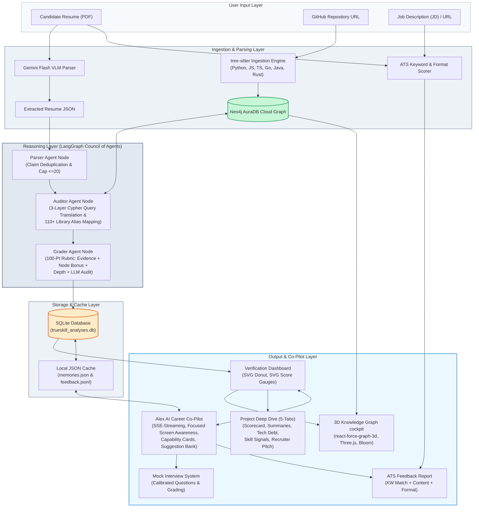

# TrueSkill AI: System Architecture Flowchart

Below is the Mermaid flowchart visualizing the data flow and layer interactions in **TrueSkill AI: Automated Competency Verification System**.

### Flow Walkthrough

1. **User Input:** The candidate uploads their double-column PDF resume and GitHub repository URL. If matching against a role, a Job Description (or URL) is also provided.
2. **Ingestion Processing:** 
   - The PDF is parsed via a Gemini Vision-Language Model to extract clean claim blocks (mapped by topic, difficulty, and libraries).
   - The codebase is parsed by `tree-sitter` to construct an Abstract Syntax Tree (AST) stored in `Neo4j AuraDB`.
3. **Multi-Agent Audit:** Orchestrated via `LangGraph` in a 3-agent pipeline (Parser $\rightarrow$ Auditor $\rightarrow$ Grader). The Auditor translates natural language resume claims into Cypher queries, resolving library aliases. The Grader audits complexity and applies a 100-point rubric.
4. **Co-Pilot and Output:** The SQLite database stores candidate profiles and comparative scoring. The Next.js frontend renders an SVG verification dashboard, an interactive 3D Force-Directed Graph, the 5-tab Project Deep Dive panel, and **Alex**—the SSE-streaming AI career coach that triggers mock interviews, salary intelligence, resume tailoring, and email drafts.
